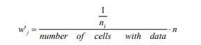

<!-- README.md is generated from README.Rmd. Please edit that file -->

```{r, include = FALSE}
knitr::opts_chunk$set(
  collapse = TRUE,
  comment = "#>",
  fig.path = "man/figures/README-",
  out.width = "100%"
)
```
# declusteringr

<!-- badges: start -->
<!-- badges: end -->

The goal of **declusteringr** is to declustering spatial data.
This package offers support for the `sf` spatial objects.

## Installation

<!-- You can install the released version of declusteringr from [CRAN](https://CRAN.R-project.org) with: -->

<!-- ``` r -->
<!-- install.packages("declusteringr") -->
<!-- ``` -->

You can install the development version of declusteringr with:

``` r
# install.packages("remotes")
remotes::install_github("declusteringr")
```

## Examples

Let's start with reading the data:

```{r}
library(sf)
points4 = sf::st_read(system.file("points/punkty4.shp", package = "declusteringr"))
```

### Cell declustering

This is a basic example of cell declustering:

```{r example}
library(declusteringr)
x = gridWeighted(spatial_object = points4, cellsize = 0.09)
x
```

Plot input data and weighted points:

```{r plot1}
par(mfrow = c(1, 2))
plot(st_geometry(points4), main = "original data")
plot(x["received_weights"], main = "cell declustering",
     key.pos = NULL, reset = FALSE)
```

`gridWeighted()` is adding the following columns: `row.id` - the cell's number, `col.id` - the point's number, `received_weights` - the weight of each cell, and `lengths` - a number of points in cell.
`gridWeighted()` does not change the number of features.
Weights are calculated according to the equation:



, where *n~i~* is the number of samples in the cell in which sample *j* is located and *n* is the total number cells with samples.

### Random declustering

This is basic example of random declustering:

```{r}
y = gridRandom(spatial_object = points4, cellsize = 0.09, numpoint = 2)
y
```

Plot input data and data after random declustering:

```{r plot2}
par(mfrow = c(1, 2))
plot(st_geometry(points4), main = "original data")
plot(y, main = "random declustering",
     key.pos = NULL, reset = FALSE)
```

`gridRandom()` is choosing random features by specifying some parameters.
`gridRandom()` can change the number of features.

## References

