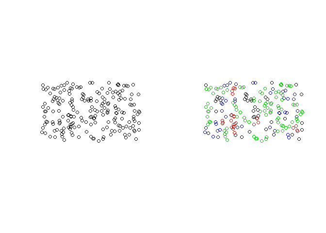
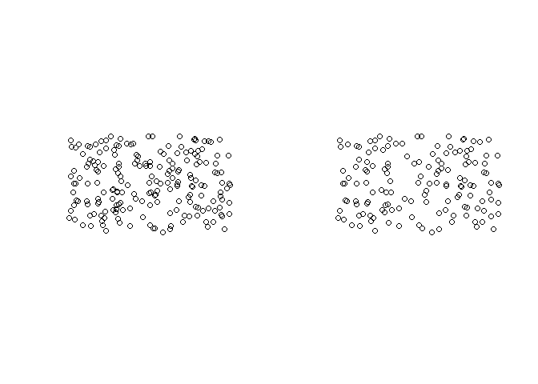

<!-- README.md is generated from README.Rmd. Please edit that file -->

# declusteringr

<!-- badges: start -->

<!-- badges: end -->

The goal of declusteringr is to declustering spatial data. This package
offers support for `sf` spatial objects.

## Installation

You can install the released version of declusteringr from
[CRAN](https://CRAN.R-project.org) with:

``` r
install.packages("declusteringr")
```

## Examples

This is a basic example of cell declustering:

``` r
library(declusteringr)
points4 = sf::st_read(system.file("points/punkty4.shp", package = "declusteringr"))
#> Reading layer `punkty4' from data source `/home/jn/R/x86_64-redhat-linux-gnu-library/3.6/declusteringr/points/punkty4.shp' using driver `ESRI Shapefile'
#> Simple feature collection with 200 features and 1 field
#> geometry type:  POINT
#> dimension:      XY
#> bbox:           xmin: -1.032267 ymin: -0.1410416 xmax: 0.09442347 ymax: 0.5297012
#> epsg (SRID):    4326
#> proj4string:    +proj=longlat +datum=WGS84 +no_defs
x = gridWeighted(spatial_object = points4, cellsize = 0.09)
#> although coordinates are longitude/latitude, st_intersects assumes that they are planar
```

Plot input data and weighted points:

``` r
par(mfrow=c(1,2))
plot(x$geometry)
plot(x$geometry, col = unlist(x$received_weights))
```



`gridWeighted` is adding columns row.id - the cell’s number, col.id -
the point’s number, received\_weights - the weight of each cell and
lengths - amounts of each points in cell. `gridWeighted` does not change
amount of features. Weights are calculated according to this
pattern:

\[ {w}'_j = \frac{\frac{1}{n_i}}{number\;of\;cells\;with\;data}\cdot n \]

where $ n\_i $ is the number of samples in the cell in which sample $ j
$ is located and $ n $ is the total number cells with samples.

This is basic example of random declustering:

``` r
y = gridRandom(spatial_object = points4, cellsize = 0.09, numpoint = 2)
#> although coordinates are longitude/latitude, st_intersects assumes that they are planar
```

Plot input data and data after random declustering:

``` r
par(mfrow=c(1,2))
plot(x$geometry)
plot(y)
```



`gridRandom` is choosing random features by specifying some parameters.
`gridRandom` can change amount of features.
