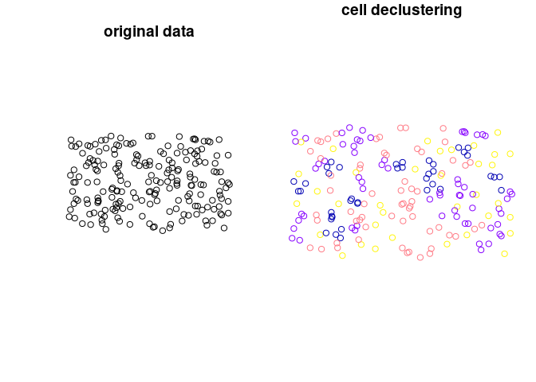

<!-- README.md is generated from README.Rmd. Please edit that file -->

# declusteringr

<!-- badges: start -->

<!-- badges: end -->

The goal of **declusteringr** is to declustering spatial data. This
package offers support for the `sf` spatial
objects.

## Installation

<!-- You can install the released version of declusteringr from [CRAN](https://CRAN.R-project.org) with: -->

<!-- ``` r -->

<!-- install.packages("declusteringr") -->

<!-- ``` -->

You can install the development version of declusteringr with:

``` r
# install.packages("remotes")
remotes::install_github("declusteringr")
```

## Examples

Let’s start with reading the data:

``` r
library(sf)
#> Linking to GEOS 3.6.1, GDAL 2.2.3, PROJ 4.9.3
points4 = sf::st_read(system.file("points/punkty4.shp", package = "declusteringr"))
#> Reading layer `punkty4' from data source `C:\Users\Lenovo\Documents\R\win-library\3.6\declusteringr\points\punkty4.shp' using driver `ESRI Shapefile'
#> Simple feature collection with 200 features and 1 field
#> geometry type:  POINT
#> dimension:      XY
#> bbox:           xmin: -1.032267 ymin: -0.1410416 xmax: 0.09442347 ymax: 0.5297012
#> epsg (SRID):    4326
#> proj4string:    +proj=longlat +datum=WGS84 +no_defs
```

### Cell declustering

This is a basic example of cell declustering:

``` r
library(declusteringr)
x = gridWeighted(spatial_object = points4, cellsize = 0.09)
#> although coordinates are longitude/latitude, st_intersects assumes that they are planar
x
#> Simple feature collection with 200 features and 3 fields
#> geometry type:  POINT
#> dimension:      XY
#> bbox:           xmin: -1.032267 ymin: -0.1410416 xmax: 0.09442347 ymax: 0.5297012
#> epsg (SRID):    4326
#> proj4string:    +proj=longlat +datum=WGS84 +no_defs
#> First 10 features:
#>     id received_weights lengths                       geometry
#> 157  0         4.545455       2   POINT (0.005593351 0.392986)
#> 128  1         3.030303       3   POINT (-0.01407625 0.280163)
#> 140  2         1.298701       7   POINT (-0.4931845 0.3204552)
#> 4    3         3.030303       3 POINT (-0.7998737 -0.09106148)
#> 173  4         3.030303       3   POINT (-0.6024538 0.4721198)
#> 141  5         1.298701       7   POINT (-0.4999889 0.3408532)
#> 187  6         4.545455       2   POINT (-0.8074892 0.4988539)
#> 110  7         3.030303       3   POINT (-0.9635923 0.2408171)
#> 152  8         3.030303       3   POINT (-0.1446985 0.3359325)
#> 43   9         2.272727       4 POINT (0.03232037 -0.02043053)
```

Plot input data and weighted points:

``` r
par(mfrow = c(1, 2))
plot(st_geometry(points4), main = "original data")
plot(x["received_weights"], main = "cell declustering",
     key.pos = NULL, reset = FALSE)
```



`gridWeighted()` is adding the following columns: `received_weights` -
the weight of each cell, and `lengths` - a number of points in cell.
`gridWeighted()` does not change the number of features. Weights are
calculated according to the equation:


, where *n<sub>i</sub>* is the number of samples in the cell in which
sample *j* is located and *n* is the total number cells with samples.

### Random declustering

This is basic example of random declustering:

``` r
y = gridRandom(spatial_object = points4, cellsize = 0.09, numpoint = 2)
#> although coordinates are longitude/latitude, st_intersects assumes that they are planar
y
#> Simple feature collection with 144 features and 0 fields
#> geometry type:  POINT
#> dimension:      XY
#> bbox:           xmin: -1.032267 ymin: -0.1410416 xmax: 0.09442347 ymax: 0.5297012
#> epsg (SRID):    4326
#> proj4string:    +proj=longlat +datum=WGS84 +no_defs
#> First 10 features:
#>                              geom
#> 1  POINT (-0.9933803 -0.05165088)
#> 2  POINT (-0.9401051 -0.09067107)
#> 3   POINT (-0.881981 -0.09763874)
#> 4   POINT (-0.7750732 -0.1312637)
#> 5  POINT (-0.7998737 -0.09106148)
#> 6   POINT (-0.6788683 -0.0741609)
#> 7  POINT (-0.6063728 -0.09643894)
#> 8  POINT (-0.4681831 -0.09190032)
#> 9   POINT (-0.4340456 -0.1129716)
#> 10  POINT (-0.3762444 -0.1410416)
```

Plot input data and data after random declustering:

``` r
par(mfrow = c(1, 2))
plot(st_geometry(points4), main = "original data")
plot(y, main = "random declustering",
     key.pos = NULL, reset = FALSE)
```


`gridRandom()` is choosing random features by specifying some
parameters. `gridRandom()` can change the number of features.

## References

1.  Declustering and Debiasing - M. J. Pyrcz (<mpyrcz@ualberta.ca>) and
    C. V. Deutsch (<cdeutsch@ualberta.ca>) Centre for Computational
    Geostatistics University of Alberta, Edmonton, Alberta, CANADA
