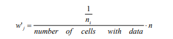

<!-- README.md is generated from README.Rmd. Please edit that file -->

# declusteringr

<!-- badges: start -->

<!-- badges: end -->

The goal of **declusteringr** is to declustering spatial data. This
package offers support for the `sf` spatial
objects.

## Installation

<!-- You can install the released version of declusteringr from [CRAN](https://CRAN.R-project.org) with: -->

<!-- ``` r -->

<!-- install.packages("declusteringr") -->

<!-- ``` -->

You can install the development version of declusteringr with:

``` r
# install.packages("remotes")
remotes::install_github("declusteringr")
```

## Examples

Let’s start with reading the data:

``` r
library(sf)
#> Linking to GEOS 3.6.1, GDAL 2.2.3, PROJ 4.9.3
points4 = sf::st_read(system.file("points/punkty4.shp", package = "declusteringr"))
#> Reading layer `punkty4' from data source `C:\Users\Lenovo\Documents\R\win-library\3.6\declusteringr\points\punkty4.shp' using driver `ESRI Shapefile'
#> Simple feature collection with 200 features and 1 field
#> geometry type:  POINT
#> dimension:      XY
#> bbox:           xmin: -1775590 ymin: -5316527 xmax: -1642585 ymax: -5237789
#> epsg (SRID):    NA
#> proj4string:    +proj=tmerc +lat_0=0 +lon_0=19 +k=0.9993 +x_0=500000 +y_0=-5300000 +ellps=GRS80 +units=m +no_defs
```

### Cell declustering

This is a basic example of cell declustering:

``` r
library(declusteringr)
x = declstr_weighted(spatial_object = points4, cellsize = 10000)
x
#> Simple feature collection with 200 features and 3 fields
#> geometry type:  POINT
#> dimension:      XY
#> bbox:           xmin: -1775590 ymin: -5316527 xmax: -1642585 ymax: -5237789
#> epsg (SRID):    NA
#> proj4string:    +proj=tmerc +lat_0=0 +lon_0=19 +k=0.9993 +x_0=500000 +y_0=-5300000 +ellps=GRS80 +units=m +no_defs
#> First 10 features:
#>     id received_weights lengths                  geometry
#> 172  0        13.333333       1 POINT (-1652995 -5254057)
#> 121  1         3.333333       4 POINT (-1655337 -5267243)
#> 139  2         3.333333       4 POINT (-1711804 -5262422)
#> 3    3         6.666667       2 POINT (-1748079 -5310699)
#> 187  4         6.666667       2 POINT (-1724664 -5244599)
#> 140  5         3.333333       4 POINT (-1712603 -5260028)
#> 179  6         6.666667       2 POINT (-1748891 -5241387)
#> 99   7         3.333333       4 POINT (-1767435 -5271677)
#> 150  8         6.666667       2 POINT (-1670705 -5260691)
#> 41   9         4.444444       3 POINT (-1649904 -5302388)
```

Plot input data and weighted points:

``` r
par(mfrow = c(1, 2))
plot(st_geometry(points4), main = "original data")
plot(x["received_weights"], main = "cell declustering",
     key.pos = NULL, reset = FALSE)
```


`declstr_weighted()` is adding the following columns: `received_weights`
- the weight of each cell, and `lengths` - a number of points in cell.
`declstr_weighted()` does not change the number of features. Weights are
calculated according to the equation:



, where *n<sub>i</sub>* is the number of samples in the cell in which
sample *j* is located and *n* is the total number cells with samples.

### Random declustering

This is basic example of random
declustering:

``` r
y = declstr_random(spatial_object = points4, cellsize = 10000, numpoint = 2)
y
#> Simple feature collection with 159 features and 0 fields
#> geometry type:  POINT
#> dimension:      XY
#> bbox:           xmin: -1775590 ymin: -5316527 xmax: -1643538 ymax: -5237789
#> epsg (SRID):    NA
#> proj4string:    +proj=tmerc +lat_0=0 +lon_0=19 +k=0.9993 +x_0=500000 +y_0=-5300000 +ellps=GRS80 +units=m +no_defs
#> First 10 features:
#>                         geom
#> 1  POINT (-1764673 -5310663)
#> 2  POINT (-1757793 -5311478)
#> 3  POINT (-1748079 -5310699)
#> 4  POINT (-1748461 -5307808)
#> 5  POINT (-1745143 -5315420)
#> 6  POINT (-1733773 -5308707)
#> 7  POINT (-1725205 -5311317)
#> 8  POINT (-1708887 -5310775)
#> 9  POINT (-1705916 -5313721)
#> 10 POINT (-1704856 -5313243)
```

Plot input data and data after random declustering:

``` r
par(mfrow = c(1, 2))
plot(st_geometry(points4), main = "original data")
plot(y, main = "random declustering",
     key.pos = NULL, reset = FALSE)
```


`declstr_random()` is choosing random features by specifying some
parameters. `declstr_random()` can change the number of features.

## References

1.  Declustering and Debiasing - M. J. Pyrcz (<mpyrcz@ualberta.ca>) and
    C. V. Deutsch (<cdeutsch@ualberta.ca>), Centre for Computational
    Geostatistics University of Alberta, Edmonton, Alberta, CANADA
2.  Praktyczny poradnik – jak szybko zrozumieć i wykorzystać
    geostatystykę w pracy badawczej Practical guide – How to fast
    understand and use geostatistics in own research work - prof. UAM
    Alfred Stach, Uniwersytet im. Adama Mickiewicza w Poznaniu
3.  Cell Declustering Parameter Selection - C. V. Deutsch
4.  Nowosad, J., (2019). Geostatystyka w R. Poznań: Space A. ISBN
    978-83-953296-0-9. Online:
    <https://bookdown.org/nowosad/Geostatystyka/>
5.  Tobler W. (1970), A Computer Model Simulating Urban Growth in
    Detroit Region, “Economic Geography” 46(2)
